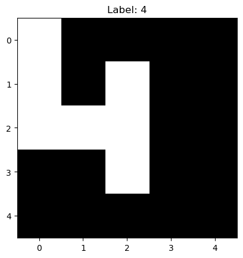
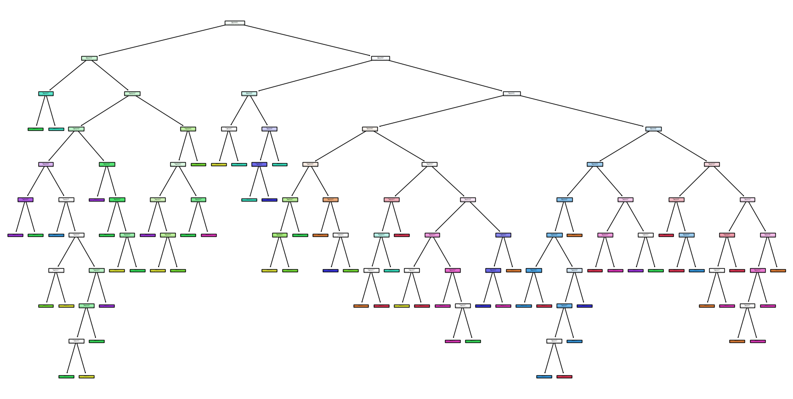

   

# tt08-decisiontree-asic
This project explores the generation of custom ml hardware from ml software.

## Project Overview

The goal is to create a custom ASIC that classifies 5x5 images of digits.

This is achieved by:
1. Training a sklearn model on the dataset.
2. Parsing the decision tree structure.
3. Generating HDL from amaranth.

This project is made viable by the tinytapeout open ASIC initiative.

## Model Overview

The dataset is composed of binary 5x5 images as shown in the following picture:

The model has flattened view of the image and has the following structure:

