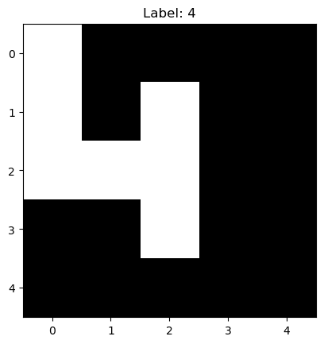
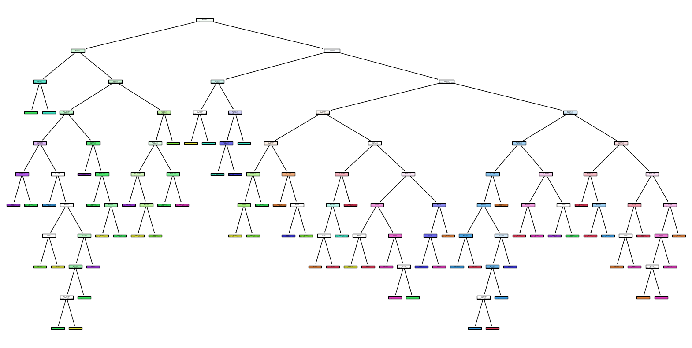

<!---

This file is used to generate your project datasheet. Please fill in the information below and delete any unused
sections.

You can also include images in this folder and reference them in the markdown. Each image must be less than
512 kb in size, and the combined size of all images must be less than 1 MB.
-->

## How it works

This project aims to perform digit recognition using a very simple ml model called a "decision tree".

The digits are small images of 5x5 binary pixels. The following picture is a representation of the digit 4:

The decision tree model is essentially a series of if-else statements. The leaf nodes of the tree contain the digit that the model predicts.

A decision Tree with a high leaf purity means that each leaf node contains a single class. This is the case for the tree in the picture above.

In order to get the 5x5 image into the device through the 8 bit bus, the image is flattened into a 1D array of 25 elements. The rows are then sent one by one to the device with the following structure:

| 0:3 | 3:8 |
|-----|-----|
| row number  | row pixels  |

The output of the device is the predicted digit.

## How to test

The ironic part is that to test this project you most likely need an external mcu which would run the model much faster than the asic...
You can also use a parallel to serial converter to send the data to the device.

## External hardware

The minimum required external hardware is a switch matrix to shape the digits and a parallel to serial converter to send the data to the device. 
